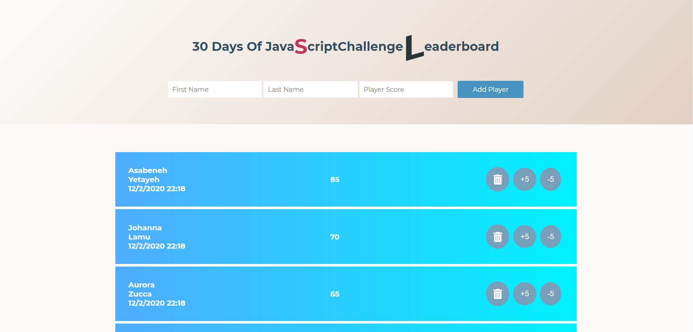

# JavaScript Mini Apps

## Table of contents

- [General Info](#General-Info)
- [Tech Stack Used](#tech-stack-used)
- [Hexadecimal Color Generator](#hexadecimal-color-generator)
- [HTML Table Generator](#html-table-generator)
- [Countries of The World](#countries-of-the-world)
- [Chuck Norris Joke Generator](#chuck-norris-joke-generator)
- [Budget App](#budget-app)
- [Score Leaderboard](#score-leaderboard)
- [Weight Calculator on Planets](#weight-calculator-planets)
- [Word Counter](#word-counter)
- [Form Validation](#form-validation)

## General Info

These JavaScript mini apps are all different projects built during my studying at Integrify Coding Academy in Helsinki. They are either part of the Integrify curricula or projects coded within the 30 Days JavaScript Challenge created by my teacher Asabeneh Yetayeh. Thanks to these projects, coded entirely from scratch, with no help from videos or coding along with tutorials, I have strengthened considerably my problem-solving skills, and I have improved my ability to be an active learner and to think and structure the code from scratch. The app section is built entirely on JavaScript. 

## Tech Stack Used

- HTML
- CSS
- JavaScript

## Hexadecimal Color Generator

This app generates random hexadecimal colors. User can start and stop a timer, enter a number value to generate more rows of colors, and copy the color’s code from a Copy button.

## HTML Table Generator

This app generates an HTML table based on user input. User can personalize the table adding parameters such as width, border, border color, font size. Once the table is generated, it can be converted to HTML code and copied.

## Countries of The World

This app displays countries of the world that can be searched or sorted alphabetically. 

## Chuck Norris Joke Generator

This app generates random jokes about Chuck Norris using the Chuck Norris free JSON API. User can rate jokes from  1 to 4.

## Budget App

This app allows users to add or delete income or expenses, and calculates the total budget and the percentage of expenses compared to income. 

## Score Leaderboard

This simple JavaScript scoreboard allows a user to enter a name and a score for each entry, delete a player’s score and add or increase the score by 5 points. The scoreboard is sorted by the highest score and updates each time the user increases or decreases a player’s score. 

## Weight Calculator on Planets

This app allows users to calculate the weight of an object in different planets.

## Word Counter

This app cleans a text from unnecessary special characters and counts the number of words present in a text. It displays the variety of text in percentage, the longest 3 words and the number of palindromes. 

## Form Validation

A simple form validator using Regular Expressions (Regex).

